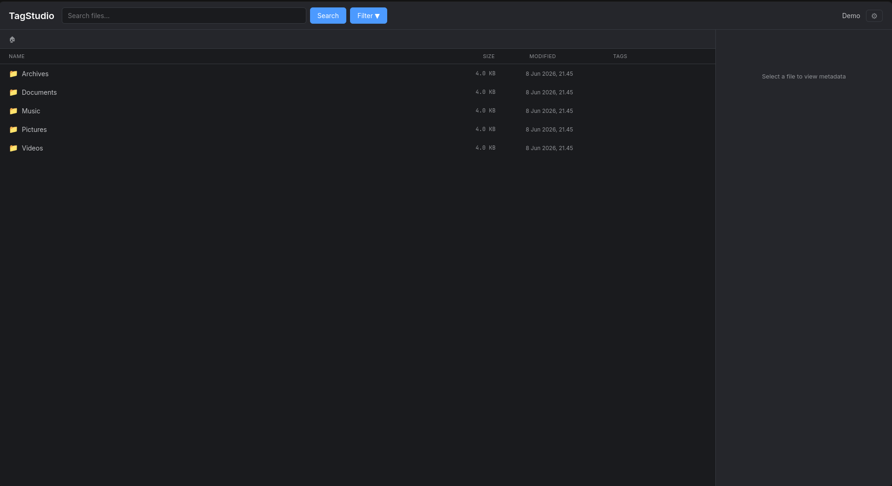
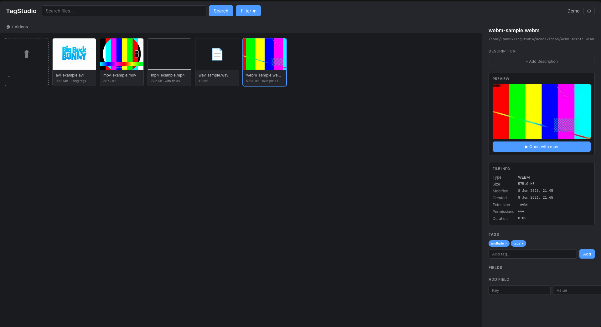
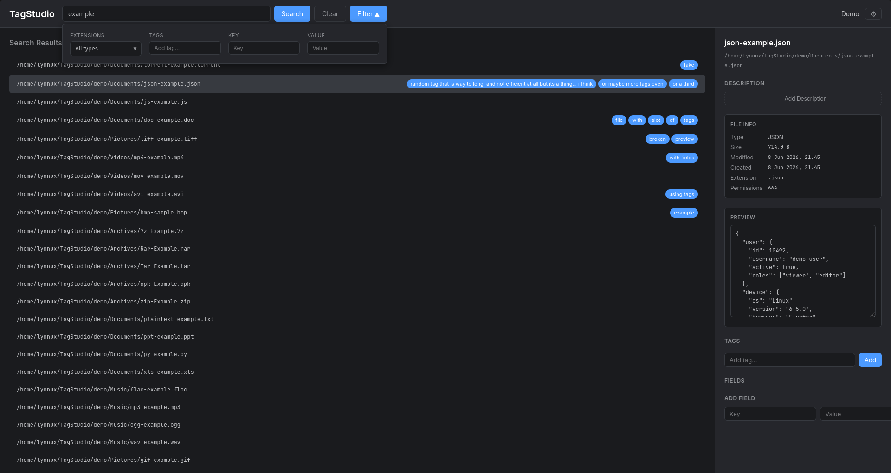
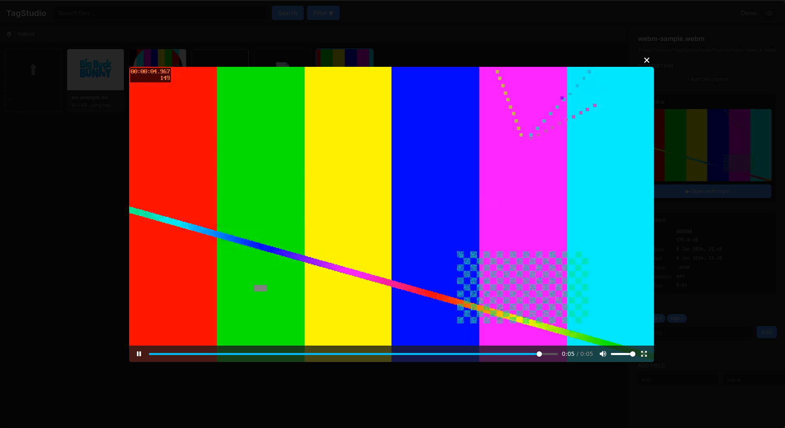

# TagStudio

Tagged file browser and metadata manager — browse, tag, search, and organize files through a web UI.

> **Try the demo:** [tagstudio.lynnux.xyz](https://tagstudio.lynnux.xyz/)

<div align="center">
  
  
  
  
</div>

## Prerequisites

| Dependency | Required for | Install |
|---|---|---|
| Node.js >= 20 | Runtime | https://nodejs.org |
| pnpm | Package management | `npm install -g pnpm` |
| ffmpeg | Video thumbnails | `apt install ffmpeg` / `brew install ffmpeg` |
| 7z | Archive extraction | `apt install p7zip-full` / `brew install p7zip` |
| mpv | "Open with mpv" | `apt install mpv` / `brew install mpv` |
| YACReader | "Open with YACReader" | https://www.yacreader.com |

Optional: Nix (supports `direnv` with flake.nix for dev shell).

## Setup

```bash
# Install JS dependencies
pnpm install

# Configure environment
cp .env.example .env   # (create one from the template below)
```

### Environment Variables

| Variable | Default | Description |
|---|---|---|
| `ROOT` | `/mnt/other/DATA` | Root directory for file browsing |
| `PORT` | `3000` | Server port |
| `DATA_DIR` | `./data` | SQLite database directory |
| `BASE_URL` | `http://localhost:3000` | Public-facing server URL |
| `NODE_ENV` | - | Set to `production` in production, `demo` for demo mode |
| `ORIGIN` | `http://localhost:3000` | Allowed CORS origin (production) |

Example `.env`:

```
ROOT=/host
PORT=3000
BASE_URL=http://localhost:3000
DATA_DIR=./data
```

## Development

```bash
# Start both server and client with hot reload
pnpm dev

# Or separately:
pnpm dev:server   # Hono API server (port 3000)
pnpm dev:client   # Vite dev server (port 5173, proxies /api to :3000)
```

## Production

```bash
# Build client + server
pnpm build

# Start production server
pnpm start
```

The server serves the built client SPA and the API on the same port.

## Tests

```bash
pnpm test
```

## Scripts

| Command | Description |
|---|---|
| `pnpm dev` | Concurrent dev servers |
| `pnpm dev:server` | API server with tsx watch |
| `pnpm dev:client` | Vite dev server |
| `pnpm build:client` | Build client to `dist/client` |
| `pnpm build:server` | Build server to `dist/server` |
| `pnpm build` | Full build |
| `pnpm start` | Production start |
| `pnpm test` | Run tests |

## Architecture

```
src/
├── client/          # React SPA (Vite)
│   ├── components/  # UI components
│   ├── hooks/       # API client hooks
│   ├── styles/      # CSS
│   └── types/       # TypeScript types
└── server/          # Hono API server
    ├── routes/      # Route handlers
    ├── db/          # SQLite setup
    ├── utils/       # Shared utilities
    └── fileInfoExtras/ # Extension-specific file parsers
```

Data is stored in a SQLite database (`data/tagger.db`) with WAL mode. Authentication uses `better-auth` with email/password.

---

*Built with [opencode](https://opencode.ai) assistance.*
